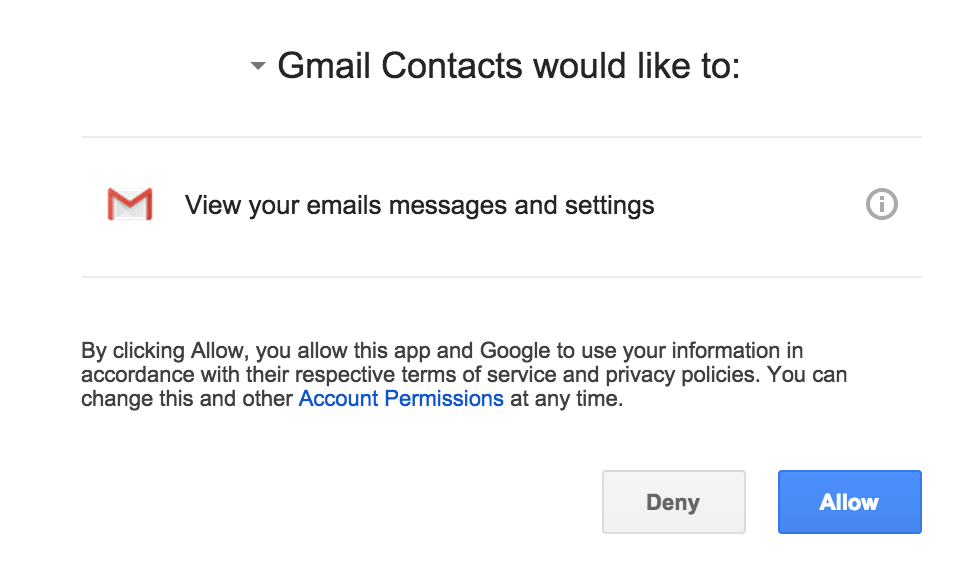
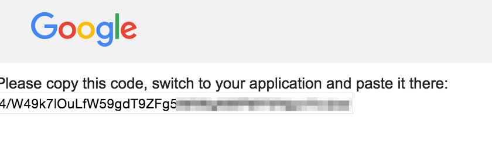

# Google Contacts

The app will extract all contacts from Gmail emails. It takes From, To, and Cc fields and saves them into a MongoDB database. Each time the app is executed it will only scan new emails and add them into a DB (if it's not in DB already).

#### Parsed fields from email
The utility parses below fields from email:

- **To** - To email address
- **From** - From
- **Cc** - CC

If the email already exists in the DB, the app will ignore it and not add or update it. Otherwise it will add it.

#### DB Collections
The utility creates and saves data into bellow MongoDB collections:

##### Contacts Collection
Stores all parsed emails. Has these fields:
- **email** -  the rmail from To, From, Cc fields
- **name** -  name of the contact
- **account** - name of the account. The account represents the unique field that groups all parsed contacts. It's exits mostly so in the future this can be a multi-tenant system.

##### Settings Collection
Settings collection stores the last date when we parsed the email. It has these fields:
- **saved** - last date the utility processed email. This is used so we only check messages after this date and don't constantly check the entire mailbox.
- **account** - the account name for the setting

## Getting Started

### 1. Prerequesites
To run the app quickstart, you'll need:

- [Go](https://golang.org/), latest version recommended.
- [Git](https://git-scm.com/), latest version recommended.
- Access to the internet and a web browser.
- A Google account with Gmail enabled.

### 2. Get the Code

Use Git to get the code:

        $ git clone https://github.com/vcollak/GmailContacts.git
        Cloning into 'gmailcontacts'...
        remote: Counting objects: 87, done.
        remote: Compressing objects: 100% (84/84), done.
        remote: Total 87 (delta 42), reused 0 (delta 0)
        Unpacking objects: 100% (87/87), done.
        Checking connectivity... done.

### 2. Enable Gmail API
1.  Use this [wizard](https://console.developers.google.com/start/api?id=gmail) to create or select a project in the Google  - - Developers Console and automatically enable the API. Click the **Go to credentials** button to continue.
2. At the top of the page, select the **OAuth consent screen** tab. Select an **Email address**, enter a **Product name** if not already set, and click the **Save** button.
3. Back on the **Credentials** tab, click the **Add credentials** button and select **OAuth 2.0 client ID**.
4. Select the application type **Other** and click the **Create** button.
5. Click **OK** to dismiss the resulting dialog.
6. Click the  **(Download JSON)** button to the right of the client ID. Move this file to the same directory where you downloaded the code and rename it to client_secret.json.

### 3. Configure the app

Configure known emails and Mongo constants in main.go. The known emails is used to ignore any known emails that you don't want to add to the DB. Because we are parsing To, many of the emails may be your actual email. It would be good to simply ignore it. The **accountName** does not have to be the same email, but it would not hurt to make it the same email.

    var knownEmails = []string{"my@email.com"}

    const (
      server      = "127.0.0.1"     //DB server address
      dbName      = "GmailContacts" //DB name
      accountName = "my@email.com"  //the user's account name
    )

### 4. Start MongoDB
Make sure you start your MongoDB (or the utility has access to it). If the DB does not exist, it will create it and all the necessary collections. (The current version of the script does not authenticate to Mongo DB and basically just assumes localhost access without credentials.)

### 5. Run the app
Run the GmailContacts app using go:

    $ go run main.go

The first time the app starts, the utility will first check for security credentials. Specifically, it will ask the user to open a specific link in a browser. The page will ask the user to allow the utility to access Gmail. Once approved, the user needs to paste the token back into the utility. The utility will then save the Gmail access token into ".credentials" directory.

    #########################
    #     Authorization     #
    #########################

    Open below link in your browser. Then Allow the client to access your mailbox,get the token and paste it below

    https://accounts.google.com/o/oauth2/auth?access_type=offline&client_id=4523535455-jdfsfsfdgg7dfadfafdfsdflltghgdk.apps.googleusercontent.com&redirect_uri=urn%3Aieaf%3Afg%3Aoauth%3A2.0%3Aoob&response_type=code&scope=https%3A%2F%2Fwww.googleapis.com%2Fauth%2Fgmail.readonly&state=state-token

    Paste the token here:4/CdflaksdjhfaldkfhaiC9mWGdfadhlfhaslfasdkdasd

Afterwards the utility will scan user's Gmail, extract the emails and save them into the Mongo DB collection (collection configured as "dbName"). While scanning it will print a log similar to below:

    2015/09/27 17:02:51 Starting...
    2015/09/27 17:02:51 Did not find last saved for: vlad@collak.net
    2015/09/27 17:02:51 Retrieving all messages.
    2015/09/27 17:03:03 --------------
    2015/09/27 17:03:03 Processing 100 messages...
    2015/09/27 17:03:05 2015-09-27 16:02:31 -0500 CDT
    2015/09/27 17:03:05 Saved last message date: 2015/09/27
    2015/09/27 17:03:05 From:Twitter <info@twitter.com>
    2015/09/27 17:03:05 To:OpenKloud <vlad@openkloud.com>
    2015/09/27 17:03:05 Known email. Ignoring: vlad@openkloud.com
    2015/09/27 17:03:05 Subject:Follow Khloé, Blake Shelton and YouTube on Twitter!

    2015/09/27 17:03:07 2015-09-27 15:10:06 -0500 CDT
    2015/09/27 17:03:07 From:Houston Robotics Club <info@meetup.com>
    2015/09/27 17:03:07 To:vlad@collak.net
    2015/09/27 17:03:07 Known email. Ignoring: vlad@collak.net
    2015/09/27 17:03:07 Subject:Saturday: Join 5 Robot Nerds at "Telepresence Robot Project Meetup"

### 5. View the data
Parsed emails from TO, CC, and FROM will be saved into the Mongo DB.

Troubleshooting
--------

#### Mongo Error
If you get the below error, make sure your mongo DB is started and listens to the specified server address.  

    2015/09/28 19:00:59 Starting...
    2015/09/28 19:01:11 Unable to connect to DB. Server: 127.0.0.1  dbName: GmailContactsA
    2015/09/28 19:01:11 Exiting...

#### Gmail Error
If you get the bellow error, make sure you configure the app within google developer console and download the client_secret.json.

    2015/09/28 19:00:59 Starting...
    2015/09/28 18:57:13 Unable to access Gmail. Error:open client_secret.json: no such file or directory
    exit status 1

Resources
-------
https://developers.google.com/gmail/api/quickstart/go
https://console.developers.google.com
https://godoc.org/google.golang.org/api/gmail/v1
https://tools.ietf.org/html/rfc4021

Credits
-------
Based on Google API samples.

Contact
-------
Follow Vladimir Collak on Twitter [@vcollak](https://twitter.com/vcollak)

Blog: [www.collak.net](http://www.collak.net)

The MIT License
-------

Copyright (c) 2015 Vladimir Collak

Permission is hereby granted, free of charge, to any person obtaining a copy
of this software and associated documentation files (the "Software"), to deal
in the Software without restriction, including without limitation the rights
to use, copy, modify, merge, publish, distribute, sublicense, and/or sell
copies of the Software, and to permit persons to whom the Software is
furnished to do so, subject to the following conditions:

The above copyright notice and this permission notice shall be included in
all copies or substantial portions of the Software.

THE SOFTWARE IS PROVIDED "AS IS", WITHOUT WARRANTY OF ANY KIND, EXPRESS OR
IMPLIED, INCLUDING BUT NOT LIMITED TO THE WARRANTIES OF MERCHANTABILITY,
FITNESS FOR A PARTICULAR PURPOSE AND NONINFRINGEMENT. IN NO EVENT SHALL THE
AUTHORS OR COPYRIGHT HOLDERS BE LIABLE FOR ANY CLAIM, DAMAGES OR OTHER
LIABILITY, WHETHER IN AN ACTION OF CONTRACT, TORT OR OTHERWISE, ARISING FROM,
OUT OF OR IN CONNECTION WITH THE SOFTWARE OR THE USE OR OTHER DEALINGS IN
THE SOFTWARE.
